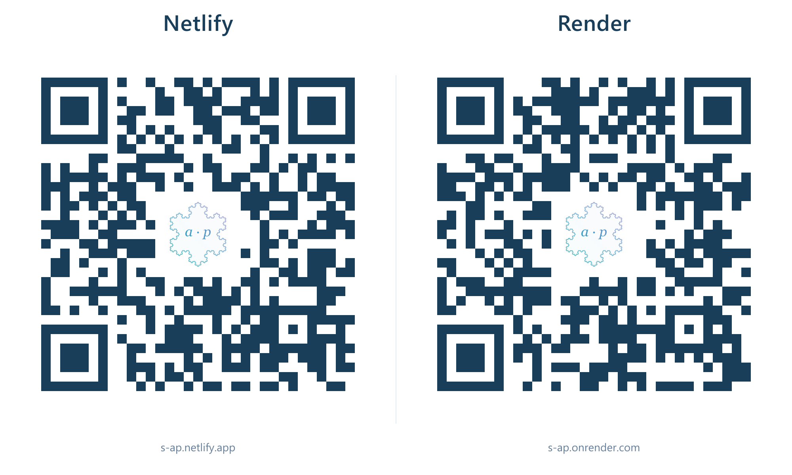

# 分析与概率讨论班

武汉大学 · 华中师范大学联合分析与概率讨论班网站。首页展示报告，后台管理摘要和讲义，正式资料保存在 GitHub。Netlify 和 Render 使用同一份报告资料，各自保存后台密码。

## 网站和管理入口

| 平台 | 网站首页 | 管理后台 | 平台设置 |
| --- | --- | --- | --- |
| Netlify | [s-ap.netlify.app](https://s-ap.netlify.app/) | [登录后台](https://s-ap.netlify.app/admin.html) | [项目控制台](https://app.netlify.com/projects/s-ap) · [环境变量](https://app.netlify.com/projects/s-ap/configuration/env) |
| Render | [s-ap.onrender.com](https://s-ap.onrender.com/) | [登录后台](https://s-ap.onrender.com/admin.html) | [服务控制台](https://dashboard.render.com/web/srv-db2tnh4s728c73akq2s0) |

代码仓库：[a-p-seminar/analysis-probability-seminar](https://github.com/a-p-seminar/analysis-probability-seminar)。更新源码提交到 `main`。

Render 使用[免费服务](https://render.com/docs/free)，闲置后首次打开可能需要等待约一分钟。Netlify 的运行和构建受账号剩余额度限制；额度不足时可使用 Render。两个网站都通过 HTTPS 访问。

## 二维码和 logo 材料

两个二维码直接进入对应网站，中心使用同款 `a · p` 科赫雪花 logo。横图左边是 Netlify，右边是 Render，不经过选择页。



| 材料 | PNG 图片 | SVG 矢量版 |
| --- | --- | --- |
| Netlify 单独二维码 | [下载 PNG](public/qr/Netlify.png) | [下载 SVG](public/qr/Netlify.svg) |
| Render 单独二维码 | [下载 PNG](public/qr/Render.png) | [下载 SVG](public/qr/Render.svg) |
| 加大版横图 | [下载 PNG](public/qr/Netlify-Render-horizontal-large.png) | [下载 SVG](public/qr/Netlify-Render-horizontal-large.svg) |
| 科赫雪花 logo | [透明背景 PNG](public/qr/logo.png) | [原始 SVG](public/qr/logo.svg) |

PNG 可以直接用于微信、海报或文档，SVG 适合放大打印。全部材料在 `public/qr/`；二维码地址固定，网站内容更新无需更换二维码。

## 日常更新报告和讲义

1. 登录任意一个线上后台，选择已有报告，或点击“新建报告”。
2. 填写标题、报告人、单位、日期和时间。单位选填，多个单位或中英文名称用 `/` 分隔。
3. 所有报告时间均按北京时间。结束时间默认比开始时间晚一小时，可以单独调整。
4. 有具体地点时填写学校和地点；没有地点就留空。粘贴完整摘要，公告链接填写对应报告在 `maths.whu.edu.cn` 或 `maths.ccnu.edu.cn` 的公告地址。
5. 点击“上传文件”添加 PDF、PPT 或 PPTX，每份最大 50 MiB。上传完成后点击“保存报告”，附件才会随报告发布。

保存后，资料和附件直接写入 GitHub。两个网站刷新首页即可看到更新，缓存最多约 15 秒。更新报告和讲义不需要重新部署。

附件放入 `attachments/年份/`，文件名为 `YYMMDD_报告人_标题首词_附件ID.ext`。首页按月份展示全部报告，并根据结束时间自动归入“即将举行”或“已经举行”。

## 知道密码：在网站后台修改

1. 打开要修改的那个网站的管理后台并登录。
2. 如果正在编辑报告，先保存，再点击顶部“修改密码”。
3. 填写当前密码、新密码和确认密码，保存。
4. 修改成功后会退出登录，用新密码重新登录。

这里修改的是当前平台的 `ADMIN_PASSWORD` 环境变量。两个平台的密码独立：在 Render 后台改密不会修改 Netlify，反之亦然。想保持一致，需要分别修改一次。

密码没有长度下限，不能为空或全为空格。密码、GitHub 令牌和平台 API 令牌不要写进 README 或源码。

## 忘记密码：从平台环境变量修改

### Netlify

1. 登录 [Netlify 的 s-ap 环境变量页面](https://app.netlify.com/projects/s-ap/configuration/env)。也可以从项目进入 **Project configuration → Environment variables**。
2. 找到 `ADMIN_PASSWORD`，展开后点击 **Edit variable**。这里保存的是后台使用的明文密码，可在有权限的账号中查看或修改。
3. 修改 **Production** 对应的值；如果使用 **Same value for all deploy contexts**，修改统一的值即可。作用范围必须包含 **Functions**。
4. 按本项目的密码同步方式，保持 **Contains secret values** 未勾选。出现敏感值提示时，选择 **Save without marking as secret**，再确认保存。
5. 回到 [Netlify 管理后台](https://s-ap.netlify.app/admin.html)，用新密码登录。

本项目会实时读取这个变量，修改 `ADMIN_PASSWORD` 不需要重新部署。Netlify 的变量作用范围和部署环境说明见[官方环境变量文档](https://docs.netlify.com/build/environment-variables/get-started/)。

### Render

1. 登录 [Render 的 s-ap 控制台](https://dashboard.render.com/web/srv-db2tnh4s728c73akq2s0)，打开左侧 **Environment**。
2. 点击编辑，找到 `ADMIN_PASSWORD`，查看或改成新密码。
3. 保存时选择 **Save only**。本项目实时读取该变量，单独改密码无需构建或重新部署。
4. 回到 [Render 管理后台](https://s-ap.onrender.com/admin.html)，用新密码登录。

Render 的保存选项见[官方环境变量说明](https://render.com/docs/configure-environment-variables)。

### 修改后仍不能登录

先确认访问的是哪个平台，再检查这个平台的 `ADMIN_PASSWORD`。旧登录会话在密码更新后失效，重新输入新密码即可。

不要改旧的 `ADMIN_PASSWORD_HASH` 来重置线上密码。不要删除 `SESSION_SECRET`、`GITHUB_TOKEN` 或平台密码同步用的 `NETLIFY_ENV_TOKEN`、`RENDER_ENV_TOKEN` 及相关项目配置。如果页面提示无法读取平台密码配置，检查这些变量是否还在、令牌是否有效。修改同步令牌或其他运行配置后，需要部署一次才能让运行中的代码读取新配置。

## 美化网页：改哪些文件

| 想调整的内容 | 文件 |
| --- | --- |
| 首页字体、字号、颜色、间距、手机和 iPad 排版 | `src/archive.css`、`src/styles.css` |
| 首页内容、标题区和筛选 | `src/main.jsx`、`src/SeminarIntro.jsx`、`src/ArchiveFilters.jsx` |
| 后台表单排版与字号 | `src/admin.css` |
| 后台字段和按钮 | `src/admin.jsx` |
| 科赫雪花曲线与 `a · p` 标志 | `src/FractalArtwork.jsx` |
| 浏览器图标与苹果设备图标 | `public/icons/` |
| 分享二维码与 logo | `public/qr/` |
| 武大背景 | `public/images/whu-enhanced.png` |
| 华师背景 | `public/images/ccnu-autumn-enhanced.png` |
| PDF 阅读页面 | `src/viewer.jsx`、`src/viewer.css` |

更换背景时使用同名图片；调整字号和间距时修改对应 CSS。先在本地查看效果，再上传改动。

## 本地查看效果和本地密码

安装 Node.js 24 和 pnpm 11.19.0，在项目目录运行：

```sh
pnpm install
pnpm setup:admin
pnpm dev
```

首页为 `http://127.0.0.1:5173/`，后台为 `http://127.0.0.1:5173/admin.html`。首次生成的本地密码在 `.local-data/admin-login.txt`，本地配置在 `.env.local`。

忘记本地密码时，在项目目录运行：

```sh
node scripts/setup-admin.mjs --rotate
```

然后从 `.local-data/admin-login.txt` 查看新密码并重新启动本地服务。这只重置本地密码，不影响 Netlify 或 Render。

本地后台修改的是本机 `content/seminars.json` 和 `attachments/`。更新正式报告请使用线上后台。

## 美化后怎么上传 GitHub

**少量文字或样式修改**：用有写入权限的 GitHub 账号打开仓库中的文件，点击编辑，修改后提交到 `main`。图片通过 **Add file → Upload files** 上传到对应目录。

**本地修改多个文件**：用 GitHub Desktop 克隆这个仓库，登录你的提交账号，修改并预览页面。完成后运行一次 `pnpm build`，确认网页能打包；选择改过的源码和图片，填写提交说明，点击 **Commit to main**，再点击 **Push origin**。参见 [GitHub Desktop 官方操作说明](https://docs.github.com/en/desktop/making-changes-in-a-branch/committing-and-reviewing-changes-to-your-project-in-github-desktop)。

仓库仍归 `a-p-seminar` 所有，提交账号需要拥有该仓库的写入权限。提交邮箱应属于该账号，或使用 GitHub **Settings → Emails** 中的隐私邮箱，这样 GitHub 才能将提交关联到你的账号。提交后可在仓库右侧 **Contributors** 或 **Insights → Contributors** 查看贡献者；列表可能稍后才刷新。

上传 `src/`、`public/` 等源码文件；修改依赖时一起上传 `package.json` 和 `pnpm-lock.yaml`。`dist/`、`node_modules/`、`.env.local` 和 `.local-data/` 留在本机。GitHub 不运行测试工作流。

## 自动部署在哪里开关

两个平台都关联这个仓库的 `main`。启用自动部署后，源码或网页图片更新会由平台构建并发布；报告、讲义、来源资料和 README 更新跳过构建。

| 平台 | 设置位置 | 开启 | 暂停 | 查看结果 |
| --- | --- | --- | --- | --- |
| Netlify | **Project configuration → Developer settings → Continuous deployment → Build settings → Configure** | **Build status → Active builds**，并保持自动发布开启 | **Stopped builds** | **Deploys** 中查看最新发布记录 |
| Render | s-ap 服务 **Settings → Auto-Deploy** | **On Commit** | **Off** | **Deploys** 中最新记录为 **Live** |

Netlify 恢复构建开关本身不会立即构建。需要发布当前版本时，在 **Deploys → Trigger deploy** 中触发一次；之后上传新代码会自动部署。参见 [Netlify 构建开关](https://docs.netlify.com/build/configure-builds/stop-or-activate-builds/)。Render 使用 **On Commit**，无需 GitHub 测试通过后再部署；参见 [Render 自动部署设置](https://render.com/docs/deploys)。

平台没有直接设置“每隔几分钟发布一次”的自动部署选项。日常美化可集中修改后一次提交。Netlify 会合并构建期间排队的更新；Render 工作区的 **Settings → Overlapping Deploy Policy → Wait** 会等待当前部署完成，再部署队列中的最新版本。这里采用平台队列功能，不额外建立定时任务或 GitHub 工作流。参见 [Netlify 队列说明](https://www.netlify.com/blog/2019/10/10/intelligent-deploy-skipping-an-automatic-optimisation/)和 [Render 重叠部署策略](https://render.com/docs/deploys#handling-overlapping-deploys)。

后台更新报告和上传讲义不需要手动部署。只有改源码、网页图片、依赖或运行配置时才需要部署；如果平台额度用完，自动部署开关不能绕过额度限制。

## 资料和备份

正式报告在 `content/seminars.json`，正式讲义在 `attachments/`，历史来源和迁移核对记录在 `sources/`。这些内容保留在仓库中。

密码和令牌只保存在平台环境变量及本机私有配置，不属于公开备份材料。GitHub 提交历史可以找回旧版本源码和资料。本机清理备份保存在被 Git 忽略的 `.local-data/` 中。
